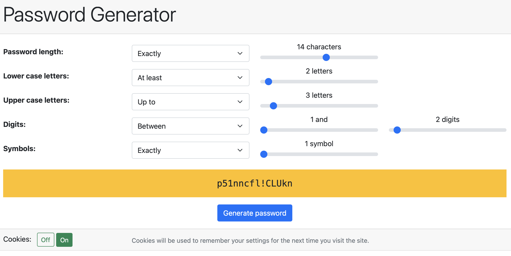

# pgweb
A simple JavaScript password generator.

## About pgweb
pgweb generates random passwords based on user-defined rules. The rules are:
* Password length
* Number of lower case letters
* Number of upper case letters
* Number of digits
* Number of symbols, from !@#$%^*()-_

## Options
The user chooses from five options for each character set:
* At least _**x**_ characters
* Between _**x**_ and _**y**_ characters
* Exactly _**x**_ characters
* Up to _**x**_ characters
* None of the characters
If cookies are enabled the selected options will be stored for future visits.

## Meta
Neil Martin - neilmartin12@me.com
Distributed under the MIT license. See `LICENCE.txt` for more information.
https://github.com/neilmartin12/pgweb
https://pw-generator.herokuapp.com

